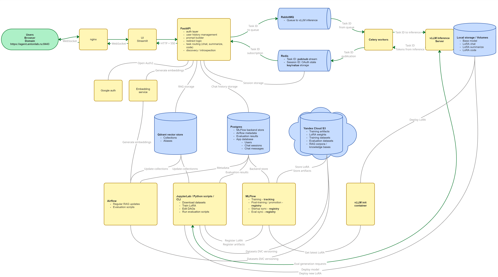

# Agent 042

Agent 042 is a single-node AI assistant platform built around RAG, LoRA adapters,
evaluation workflows, and production-style observability.

The project is not just a chat UI wrapped around an LLM. The main work here is
the surrounding system: retrieval pipelines, model adapter lifecycle, async
inference, experiment tracking, evaluation, deployment, logs, traces, durable
events, and analytics. Everything lives in one repository so runtime code,
experiments, DAGs, infrastructure, and operator workflows stay close enough to
evolve together.

The intended use case is an internal research assistant for teams that need to
work with private knowledge bases on a dedicated server.

## What It Does

The current system supports:

- authenticated chat UI with streaming responses;
- OpenAI-compatible Gateway API;
- vLLM-backed inference with runtime LoRA adapter loading;
- task-aware prompt assembly for chat, code, and summarization;
- RAG over versioned Qdrant collections;
- dense, sparse, and hybrid retrieval with optional reranking;
- async generation through Celery, RabbitMQ, Redis Pub/Sub, and vLLM;
- RAG build/materialize/promote workflows through CLI and Airflow;
- LoRA training and promotion workflows with MLflow tracking;
- evaluation pipelines for generation, retrieval, and code tasks;
- structured logs, OpenTelemetry traces, Prometheus metrics, Loki, Tempo, and
  Grafana;
- durable inference lifecycle events in Redpanda;
- ClickHouse ingestion for production inference analytics.

Architecture overview:



## Runtime Path

A user request follows this path:

1. Streamlit UI sends an authenticated chat request to the Gateway.
2. Gateway validates the session, routes the task, selects RAG sources when
   needed, and builds a budgeted prompt.
3. Gateway enqueues generation work in Celery.
4. Worker asks vLLM for exact prompt token count, applies the final response
   budget, and streams generation from vLLM.
5. Tokens are sent back through Redis Pub/Sub and streamed to the UI.
6. Chat metadata is persisted in PostgreSQL.
7. Logs, traces, and inference events are emitted for debugging and analytics.

The split is intentional: HTTP request handling stays separate from long-running
generation, and the worker owns the exact token-budget check immediately before
calling vLLM.

## Main Components

### Inference

- `gateway`: FastAPI API gateway, auth boundary, task routing, RAG orchestration,
  prompt assembly, streaming response contract.
- `vllm`: OpenAI-compatible inference server with LoRA hot-loading.
- `celery-worker`: async generation worker; talks to vLLM and streams events
  through Redis.
- `embeddings`: service for dense embeddings and sparse BM25 embeddings.
- `reranker`: cross-encoder reranking service.
- `qdrant`: vector storage for RAG collections.
- `redis`: sessions, prompt preview state, and token streaming.
- `rabbitmq`: Celery broker.
- `postgres`: operational state, auth/session-related data, chat history,
  MLflow backend, and Airflow metadata.

### RAG And Model Operations

- `rag-ops`: one-shot container for manual RAG lifecycle commands inside the
  same Docker network and dependency image as Airflow workers.
- `airflow-*`: orchestration for RAG builds, cleanup, evaluation, and LoRA
  training.
- `mlflow`: experiment tracking and model registry.
- `vllm-adapter-sync`: syncs aliased LoRA adapters from MLflow to vLLM.
- `jupyter`: notebooks for inspection, experiments, and operational analysis.
- `code-sandbox`: isolated code execution service for code evaluation tasks.

### Observability And Analytics

- `prometheus`: service and infrastructure metrics.
- `grafana`: dashboards and Explore UI.
- `loki` + `alloy`: searchable Docker/application logs.
- `tempo` + `otel-collector`: request traces.
- `redpanda` + `redpanda-console`: durable Kafka-compatible inference events.
- `clickhouse`: analytics storage for inference events and future rollups.
- `flower`: Celery queue visibility.
- `redisinsight`: Redis inspection.

## RAG Lifecycle

RAG collections are built as artifacts and served through aliases. A typical
manual build runs through `rag-ops`:

```bash
bash scripts/rag_ops.sh python -m rag.sources.cli build-source \
  --catalog catalog.toml \
  --source-instance pytorch_reference.docs \
  --rag-data-root assets/rag_data \
  --limit 1
```

The same lifecycle code is used by Airflow DAGs. Jupyter is for inspection and
curation, not as the production build entry point.

See [docs/operations/rag-operations.md](docs/operations/rag-operations.md) for
the complete validation, build, benchmark, promotion, inspection, recovery,
migration, rollback, and Airflow runbook.

## Configuration

Operator-facing configuration is split across three root files:

```text
.env
runtime.toml
catalog.toml
```

Compose reads `.env`, mounts the root TOML files into containers, and passes
`CONFIG__RUNTIME_PATH` / `CONFIG__CATALOG_PATH` explicitly. Python reads only
process env plus those mounted TOML files; shared runtime code does not load
`.env`.

## Running And Operating

This repository is designed around Docker Compose on a single dedicated server.
The full stack is defined in:

```text
infra/compose/docker-compose.yaml
```

Start with:

- [docs/index.md](docs/index.md) for the documentation map;
- [infra/README.md](infra/README.md) for server layout, `.env`, Compose, shared
  roots, deployment notes, and service ports;
- [docs/architecture/system-design.md](docs/architecture/system-design.md) for
  the detailed architecture;
- [docs/analytics/observability-evaluation-workflow.md](docs/analytics/observability-evaluation-workflow.md)
  for the end-to-end diagnostic workflow;
- [docs/analytics/observability.md](docs/analytics/observability.md) for logs,
  traces, and Grafana workflow;
- [docs/analytics/inference-events.md](docs/analytics/inference-events.md) for
  Redpanda event schema and topic inspection;
- [docs/analytics/clickhouse-analytics.md](docs/analytics/clickhouse-analytics.md)
  for ClickHouse ingestion and starter analytics queries;
- [experiments/README.md](experiments/README.md) for notebooks, evaluation, and
  experiment workflows.

## Repository Layout

```text
src/          runtime services and shared libraries
dags/         Airflow DAGs
experiments/  notebooks, eval scripts, training code, operator workflows
infra/        Dockerfiles, Compose, Grafana, ClickHouse, nginx, Prometheus
docs/         focused operator and workflow documentation
scripts/      deployment and operational shell helpers
tests/        unit and integration-style tests
assets/       datasets, RAG data pointers, model assets
```
