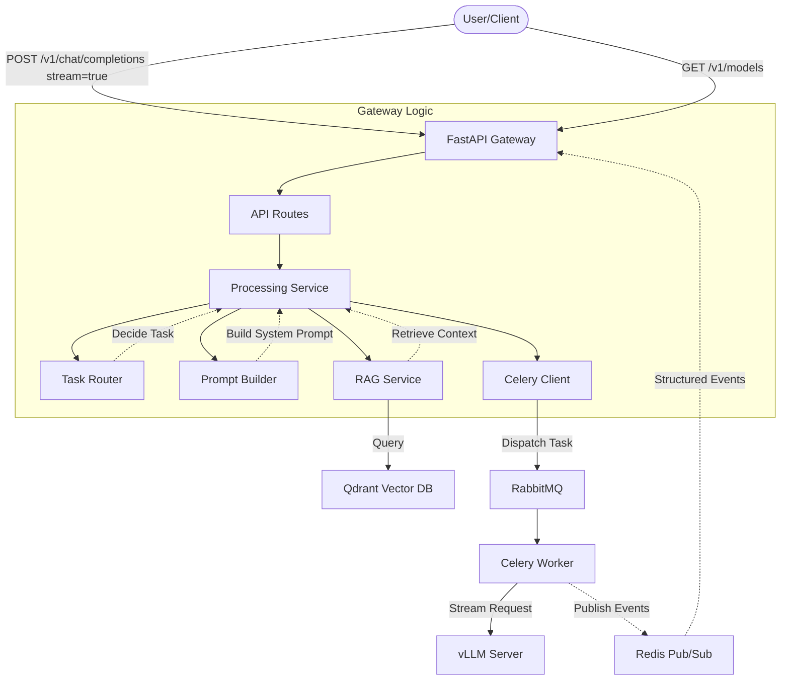
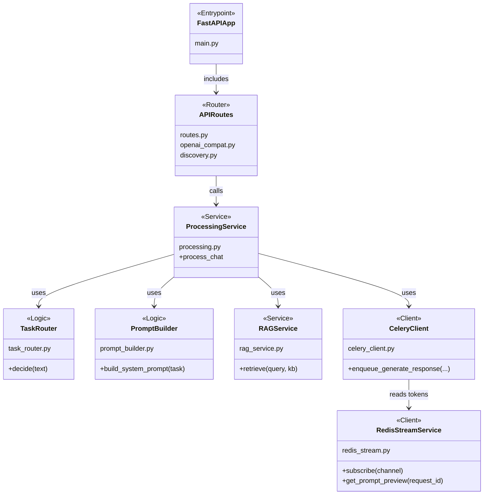

# Gateway (FastAPI)

This service is the abstraction layer in front of the vLLM OpenAI-compatible server.
It provides task routing, prompt building, RAG integration, and async SSE
execution via Celery + Redis.

## Architecture



## Structure & Classes



## Endpoints

- `GET /health`
- `GET /config`
- `GET /v1/models` (proxy)
- `POST /v1/chat/completions` (successful generation requires `stream: true`; returns SSE + `X-Request-Id`)
- `GET /v1/chat/prompt-preview/{request_id}` (prompt preview + `rag_context` for a streamed request)
- `GET /v1/knowledge-bases` — list the task-grouped KB registry, nested KB entries, and per-alias query config
- `POST /v1/admin/reload-config` — hot-reload `knowledge_bases.json` (requires authenticated session)

### Streaming Contracts

The gateway serves two chat streaming contracts:

1. Standard OpenAI-style SSE for generic clients and evaluation code.
2. Rich first-party SSE for the Streamlit UI when the request includes `X-UI-Rich-Stream: 1`.

Standard SSE emits answer delta chunks, a terminal finish chunk, a usage chunk, and `[DONE]`.
The response header `X-Request-Id` can then be used with `GET /v1/chat/prompt-preview/{request_id}`
to fetch `prompt_messages` and `rag_context`.

Rich UI SSE emits named events `thinking_token`, `answer_token`, `usage`, `done`, and `error`.

### RAG Knowledge Base Selection

The `POST /v1/chat/completions` endpoint accepts an optional `rag_sources` array
that controls which Qdrant collections are used for RAG retrieval:

| Field | Description |
|-------|-------------|
| `knowledge_base` | KB name, e.g. `"arxiv"`, `"pytorch_docs"` |
| `alias` | Alias role, e.g. `"champion"`, `"challenger"`. Uses the KB's `default_alias` when `null`. |

Example payload:

```json
{
  "messages": [{"role": "user", "content": "Explain attention mechanisms"}],
    "rag_sources": [{"knowledge_base": "arxiv", "alias": "challenger"}]
}
```

The gateway derives the final generation budget internally: it trims the prompt
approximately, the worker asks vLLM `/tokenize` for the exact prompt count, and
generation runs with that exact response budget.

### Alias-Owned Query Config

Query-time RAG parameters (`top_k`, `score_threshold`, `reranker`) are set per
alias in `knowledge_bases.json`, not via environment
variables. To change retrieval behavior:

1. Edit the alias entry in `knowledge_bases.json`
2. `POST /v1/admin/reload-config` (requires authenticated session)
3. Next request with that alias uses the new config immediately

## Environment

Shared endpoint vars use canonical names. Gateway-specific behavior keeps the
`GATEWAY_` prefix.

| Variable | Default | Description |
|----------|---------|-------------|
| `VLLM_BASE_URL` | `http://localhost:8000` | Shared vLLM server URL |
| `QDRANT_HOST` | `localhost` | Shared Qdrant host |
| `QDRANT_PORT` | `6333` | Shared Qdrant port |
| `EMBEDDINGS_URL` | `http://localhost:8100` | Shared embeddings service URL |
| `GATEWAY_RAG_ENABLED` | `true` | Enable/disable RAG |
| `GATEWAY_EMBEDDING_MODEL` | `sentence-transformers/all-MiniLM-L6-v2` | Embedding model |
| `GATEWAY_RAG_STRICT_STARTUP` | `false` | Raise on legacy/invalid Qdrant collections at startup |
| `REDIS_URL` | `redis://localhost:6379/0` | Redis stream and prompt-preview backend |
| `CELERY_BROKER_URL` | none | RabbitMQ broker URL required for async inference |

Query-time RAG parameters (`top_k`, `score_threshold`, `reranker`) live in
`knowledge_bases.json`. Prompt and response budgeting live in
`src/shared/config.py` plus the exact vLLM preflight in the worker.

See `src/shared/config.py` for the full list.

## Run (local)

`gateway.main` explicitly loads the repo-root `.env` for local runs before
settings are cached.

```bash
uv sync --extra gateway --extra worker --extra rag --group dev
PYTHONPATH=src uvicorn gateway.main:app --reload --port 9000
```
