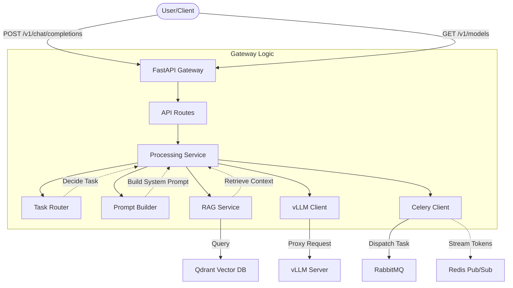
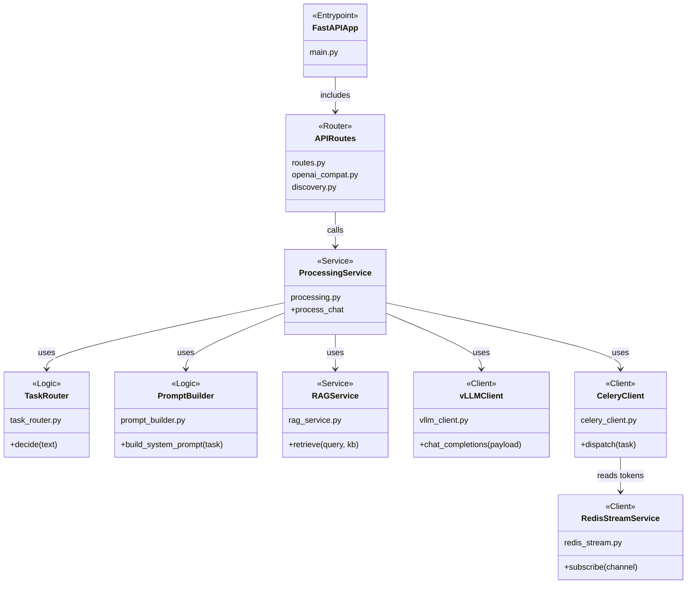

# Gateway (FastAPI)

This service is the abstraction layer in front of the vLLM OpenAI-compatible server.
It provides task routing, prompt building, RAG integration, and optional async
execution via Celery + Redis.

## Architecture



## Structure & Classes



## Endpoints

- `GET /health`
- `GET /config`
- `GET /v1/models` (proxy)
- `POST /v1/chat/completions` (proxy + prompt/router layer; supports `stream: true`)
- `GET /v1/knowledge-bases` — list available KBs, aliases, and per-alias query config
- `POST /v1/admin/reload-config` — hot-reload `knowledge_bases.json` (requires authenticated session)

### RAG Knowledge Base Selection

The `POST /v1/chat/completions` endpoint accepts an optional `rag_sources` array
that controls which Qdrant collections are used for RAG retrieval:

| Field | Description |
|-------|-------------|
| `knowledge_base` | KB name, e.g. `"arxiv"`, `"pytorch_docs"` |
| `alias` | Alias role, e.g. `"champion"`, `"challenger"`. Uses the KB's `default_alias` when `null`. |

Example payload:

```json
{
  "messages": [{"role": "user", "content": "Explain attention mechanisms"}],
  "rag_sources": [{"knowledge_base": "arxiv", "alias": "challenger"}],
  "max_completion_tokens": 512
}
```

### Alias-Owned Query Config

Query-time RAG parameters (`top_k`, `score_threshold`, `context_max_length`,
`reranker`) are set per alias in `knowledge_bases.json`, not via environment
variables. To change retrieval behavior:

1. Edit the alias entry in `knowledge_bases.json`
2. `POST /v1/admin/reload-config` (requires authenticated session)
3. Next request with that alias uses the new config immediately

## Environment

Shared endpoint vars use canonical names. Gateway-specific behavior keeps the
`GATEWAY_` prefix.

| Variable | Default | Description |
|----------|---------|-------------|
| `VLLM_BASE_URL` | `http://localhost:8000` | Shared vLLM server URL |
| `QDRANT_HOST` | `localhost` | Shared Qdrant host |
| `QDRANT_PORT` | `6333` | Shared Qdrant port |
| `EMBEDDINGS_URL` | `http://localhost:8100` | Shared embeddings service URL |
| `GATEWAY_RAG_ENABLED` | `true` | Enable/disable RAG |
| `GATEWAY_EMBEDDING_MODEL` | `sentence-transformers/all-MiniLM-L6-v2` | Embedding model |
| `GATEWAY_ASYNC_ENABLED` | `true` | Enable Celery async mode |
| `GATEWAY_RAG_STRICT_STARTUP` | `false` | Raise on legacy/invalid Qdrant collections at startup |

Query-time RAG parameters (`top_k`, `score_threshold`, `context_max_length`)
are no longer environment variables. They are now alias-owned config in
`knowledge_bases.json`. The old `GATEWAY_TOP_K` and `GATEWAY_SCORE_THRESHOLD`
env vars are retired.

See `src/shared/config.py` for the full list.

## Run (local)

`gateway.main` explicitly loads the repo-root `.env` for local runs before
settings are cached.

```bash
uv sync --extra gateway --extra worker --extra rag --group dev
PYTHONPATH=src uvicorn gateway.main:app --reload --port 9000
```
