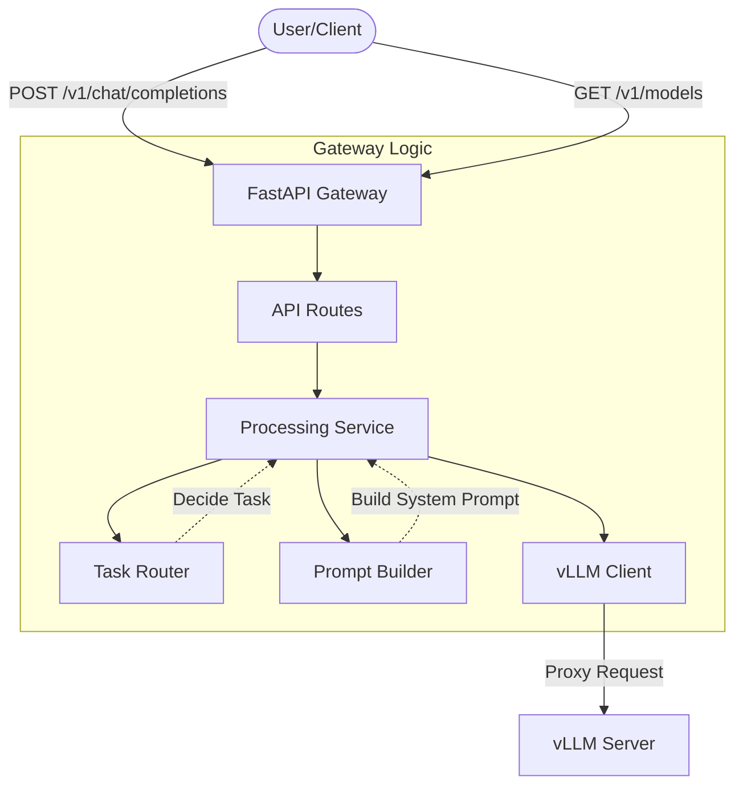
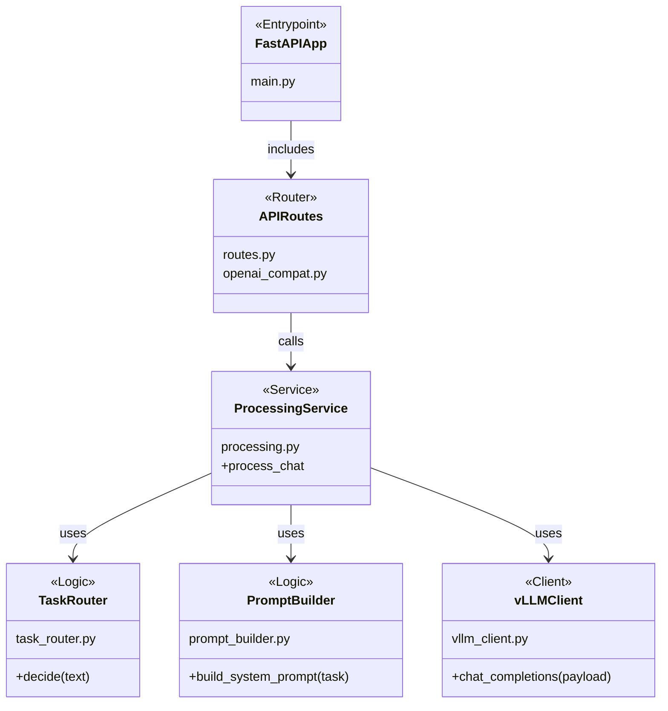

# Gateway (FastAPI)

This service is the abstraction layer in front of the vLLM OpenAI-compatible server.

## Architecture



## Structure & Classes



## Endpoints

- `GET /health`
- `GET /config`
- `GET /v1/models` (proxy)
- `POST /v1/chat/completions` (proxy + prompt/router layer)

### RAG Knowledge Base Selection

The `POST /v1/chat/completions` endpoint accepts an optional `knowledge_base` field
that controls which Qdrant collection is used for RAG retrieval:

| Value | Collection | Content |
|-------|-----------|---------|
| `null` | *(none)* | RAG disabled for this request |
| `"arxiv"` | `chat_documents` | ArXiv papers — ML / AI theory |
| `"pytorch_docs"` | `code_documents` | PyTorch documentation |

Example payload:

```json
{
  "messages": [{"role": "user", "content": "Explain attention mechanisms"}],
  "knowledge_base": "arxiv",
  "max_completion_tokens": 512
}
```

## Environment

- `GATEWAY_VLLM_BASE_URL` (default: `http://localhost:8000`)

## Run (local)

```bash
uv sync --extra gateway --extra worker --extra rag --extra dev
PYTHONPATH=src GATEWAY_VLLM_BASE_URL=http://localhost:8000 uvicorn gateway.main:app --reload --port 9000
```
