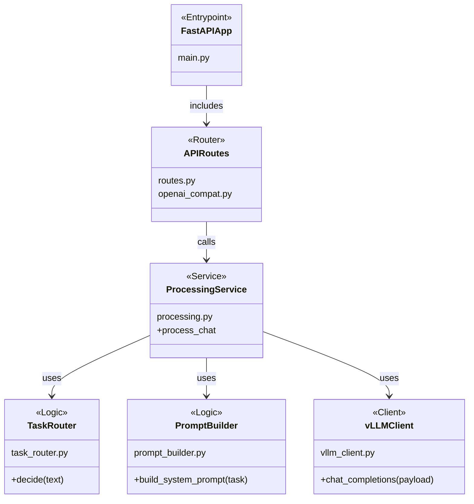

# Gateway (FastAPI)

This service is the abstraction layer in front of the vLLM OpenAI-compatible server.

## Architecture


## Structure & Classes



## Endpoints

- `GET /health`
- `GET /config`
- `GET /v1/models` (proxy)
- `POST /v1/chat/completions` (proxy + prompt/router layer)

## Environment

- `GATEWAY_VLLM_BASE_URL` (default: `http://localhost:8000`)

## Run (local)

```bash
uv sync
PYTHONPATH=src GATEWAY_VLLM_BASE_URL=http://localhost:8000 uvicorn gateway.main:app --reload --port 9000
```

